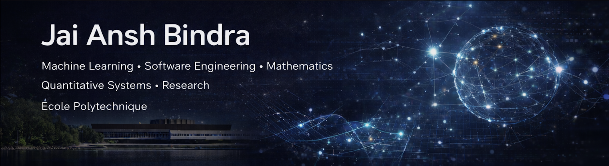

  

# Jai Ansh Bindra  
### Machine Learning • Reinforcement Learning • Quantitative Systems • Software Engineering • Founder @ JBAC EdTech

  

## Hello, नमस्ते, ਸਤਿ ਸ੍ਰੀ ਅਕਾਲ, Salut, Hola, привет 👋  Jai here.
*"The ones who go the farthest are the ones who never stop building."*

*"What you can’t measure, you can’t improve. What you can imagine, you can build."*

*“Learn the rules like a pro so you can break them like an artist.” - Picasso*

*“Greatness is engineered, not inherited.”*

*"People who are crazy enough to think they can change the world are the ones who do."*

## 🚀 About Me

I am an **entrepreneurial-minded problem-solver, systems-oriented engineer** and a **technology-finance** enthusiast, currently pursuing a **Bachelor of Science in Mathematics and Computer Science at École Polytechnique (France)**.

My interests lie at the intersection of **Machine Learning, Reinforcement Learning, Quantitative Finance, and high-performance software systems**. I am particularly drawn to problems that sit at the boundary of **theory and deployment**, where mathematical modeling, algorithmic design, and real-world engineering constraints coexist. I am also almost equally buzzed about the intricacies of LLMs, Generative AI, Computer Vision, Financial Engineering and Hardware-Software Optimization. 

I enjoy building **end-to-end systems** - from research prototypes and optimization pipelines to production-grade APIs, open-source libraries, and deployed platforms. I care deeply about **correctness, scalability, interpretability, and measurable performance**, and I prefer work that stands up to scrutiny rather than superficial demos.

Long-term, my goal is to bridge **AI/ML, Mathematics, and Finance** through a combination of **research-driven exploration and product-focused execution**, translating abstract ideas into systems that operate under realistic constraints.

---

## 🔬 Current Focus & Direction

- **Bachelor Thesis (2026)** - *Reinforcement Learning for Maritime Navigation*  
  Graph-structured RL, GNN-based traffic representations, and safety–efficiency trade-offs.

- **Building Open-source Tools and Platforms** - See [JBAC Edtech](https://jbac.dev) and keep out an eye for some upcoming repositories!

- **Quantitative Strategy & RL Systems**  
  Portfolio optimization, cost-aware RL agents, and systematic evaluation frameworks.

- **Open-source & Product Systems**  
  Designing, shipping, and maintaining production-ready ML and security tooling.

- **Multi-objective Optimization Research**  
  Attempt at Analysis of evolutionary optimizers (COMO-CMA-ES) with benchmarking against baseline solvers.

---

## 💎 Recent Work (Projects, Platforms, Open-source Libraries/SDKs and Self-motivated Research)

### 🔐 Cybersec-Scanner - Open-Source Security Scanning Toolkit |   [PyPI](https://pypi.org/project/cybersec-scanner/) |  [Repo](https://github.com/JaiAnshSB26/cybersec-scanner)
**Python • Static & Dynamic Analysis • RAG-assisted Security**

- Open-source Python toolkit for detecting **secrets, vulnerabilities, and misconfigurations** across Git repositories, web applications, browser extensions, and network traffic  
- Modular multi-scanner architecture including:
  - Git history scanning for committed secrets  
  - Web crawler for endpoint and source discovery  
  - Browser runtime inspection via Playwright  
  - Network traffic inspection through a MITM proxy  
  - RAG-assisted semantic analysis with CWE enrichment  
- Includes **50+ built-in detection patterns** for cloud providers and common services, with support for custom extensions  
- Distributed as both a **CLI tool and Python SDK**, designed for flexible integration  
- Achieved **~4,000 downloads**, demonstrating real-world adoption and developer trust

---

### ⚡ JBAC AI Trading Coach - Production ML System  | [Link](https://trading.jbac.dev) | [Public Repo](https://github.com/JaiAnshSB26/JBAC_AI_Trading_Coach_Public)
**FastAPI • Angular • AWS (Lambda, DynamoDB, EC2, Bedrock) • Finance/Trading**

- End-to-end deployed platform for **trading learning, feedback, and paper-trading simulation**  
- Real-time market-data engine computing indicators such as RSI, MACD, Bollinger Bands, SMA/EMA, and P&L  
- Multi-agent (integrated) LLM architecture (Coach / Critic / Planner) powered by Amazon Bedrock  
- Optimized for low latency, fast cold starts, and cost-efficient inference

---

### 📦 YtQGen - Open-Source Python Library/SDK (PyPI)  | [PyPI](https://pypi.org/project/ytqgen) | [Repo](https://github.com/JaiAnshSB26/YtQGen_Public)
**CLI • Audio Processing • LLM Pipelines • Optimization**

- Python library and CLI that converts educational YouTube videos into **printable questionnaires**  
- Provider-agnostic pipeline supporting multiple LLM and transcription backends  
- End-to-end workflow: audio extraction → transcription → summarization → question generation → PDF rendering  
- Modern PEP-621 packaging, automated testing, and CI/CD via GitHub Actions  
- **250+ downloads within the first 72 hours** of release

---

### ♟️ EZ-Chess - Explainable AI Chess Engine & Analysis Toolkit | [PyPI](https://pypi.org/project/ez-chess/) | [Repo](https://github.com/JaiAnshSB26/EZ-Chess)  
**Python • Stockfish • LLMs • LangGraph • Explainable Chess AI**

- Explainable AI-based chess analysis system combining classical engines with LLM reasoning  
- Integrates Stockfish for high-accuracy evaluation with natural-language explanations of moves and positions  
- Modular pipeline for best-move recommendations, mistake detection, and strategic insights  
- Uses LangGraph for structured multi-step reasoning and agent orchestration  
- Distributed as a Python SDK and CLI tool for interactive and batch analysis  
- Designed for training, education, and research with emphasis on interpretability over black-box evaluation

---

### 📚 Edu QGen - LLM-Powered Video Summarisation & Questionnaire Platform | [Live (down temporarily)](https://questionnaire.jbac.dev/)

- End-to-end platform converting educational videos into structured summaries and printable questionnaires  
- Automated pipeline: transcription → summarisation → question generation → PDF delivery  
- Optimised GPU–CPU workflow reducing processing time by ~92% on long-form videos  
- Supports large file uploads (400MB+) with secure authentication via Google OAuth  
- Cloud-native architecture using GCP VM, AWS S3/DynamoDB, and Nginx reverse proxy  
- Designed as a learning tool, emphasising speed, reliability, and accessibility

---

### 🎤 Mock AI Interviewer — Voice-to-Voice Interview Simulation Platform | [Live](https://interview.jbac.dev/) | [Pubic Forked Repo](https://github.com/JaiAnshSB26/AI-Interviewer-Public)
**Python • FastAPI • Streamlit • LLMs • Voice AI • AWS • PostgreSQL**

- Full-stack AI platform simulating real-time voice interviews with live transcription and automated feedback  
- End-to-end pipeline: speech-to-text → question generation → response analysis → PDF report delivery  
- Integrated Mistral Voxtral for transcription, GPT OSS-20B for evaluation, and gTTS for text-to-speech  
- Secure authentication and user data management using bcrypt and PostgreSQL  
- Deployed on Render with AWS S3 storage and CI/CD automation  
- Optimised for free-tier infrastructure (512MB RAM, fractional CPU) to maximise accessibility

---

## 🧠 Research & Experimental Systems

### 📈 Deep Reinforcement Learning for Portfolio Rebalancing | [Research Report](https://drive.google.com/file/d/1ycBZAP5-_pJOXsVTO76FGk3RB7YggHwZ/view?usp=sharing) | [Repo](https://github.com/JaiAnshSB26/deep-rl-rebalance)
**Python • Stable-Baselines3 • Gymnasium**

- Designed cost-aware PPO agents for multi-asset portfolio rebalancing  
- Explicit modeling of transaction costs, turnover control, and position constraints  
- Achieved **Sharpe ≈ 0.33** against multiple baselines  
- Evaluation using bootstrap confidence intervals and Diebold–Mariano tests

---

### ♟️ Ashwathama Chess Engine | [Play against the Deployed Engine](https://www.ashwathama-chess.com/) | [Repo](https://github.com/JaiAnshSB26/Ashwathama_Chess_Engine)
**C++ • Bitboards • OOP • React • Flask**

- Modular chess engine built using bitboards and clean object-oriented design  
- Implemented move generation, leaper logic, promotions, and debugging utilities  
- Integrated with a React–Flask web interface for online play  
- Ranked **Top 10 / 25** in a competitive academic setting

---
## ⏰ Upcoming

### 🧠 JBAC Strategy Foundry - Quant & AI Research Platform
**Python • Backtesting • Optimization • Machine Learning**

- Modular research and experimentation framework for **quantitative strategy design and evaluation**  
- Emphasis on systematic testing under realistic constraints rather than over-fitted backtests  
- Supports factor-based signals, portfolio construction logic, and performance analysis  
- Serves as the experimental backbone for trading and RL-based projects within JBAC

---
### 🧊 CubeBandits - Learning & Optimization in Games  
**Reinforcement Learning • Search • Heuristics**

- Experimental platform exploring AI-driven problem-solving in structured game environments  
- Focus on reward design, policy learning, and efficient state representations  
- Used as a sandbox for reinforcement-learning ideas transferable to real-world optimization tasks

---

## 🧪 Early & Archived Projects

These projects shaped my foundations in algorithmic thinking and system design:

- [Roommate Allocation Algorithm for incoming Bachelor students at École Polytechnique (constraint satisfaction; 150+ students, ~90% satisfaction)](https://github.com/JaiAnshSB26/Machine-Learning-approach-to-Roommate-Flat-mate-allocation-algorithm-for-BX-students)
- [Mentor–Mentee Allocation Algorithm](https://github.com/JaiAnshSB26/Mentor-Mentee-Allocation-Algorithm) 
- [Hackathon Scraper (v1)](https://hackathons.jbac.dev/) | [Repo](https://github.com/JaiAnshSB26/hackathon_Scraper)
- Early ML pipelines (classification, PCA, ensemble methods) - including the course project for the Machine Learning course at École Polytechnique

## 🛠️ Skills, Technologies & Competencies

### 💻 Languages
  

**Python · C++ · C · Java · Haskell · JavaScript · HTML/CSS · Bash · SQL(Foundational) · Prolog(Foundational)**

---

### 🤖 AI / ML & Data

**PyTorch · TensorFlow · scikit-learn · OpenCV · NumPy · Pandas · Stable-Baselines3 · LLM APIs**

---

### 🌐 Web & Backend
  
**FastAPI · Flask · React · Node.js · Express · PostgreSQL · MySQL · BeautifulSoup · REST APIs**

---

### ☁️ Systems & DevOps
  
**Docker · AWS · GCP · Linux · Git · Nginx · CI/CD**

---

### 🎨 UI / Visualization

**Streamlit · Matplotlib · Tkinter**

---

**Developer Tooling:** Jupyter · VSCode · IntelliJ · $\LaTeX$ · Markdown · GitHub · GitLab · Anaconda

---

### 🎯 Core Competencies

**Quantitative & Financial Systems -**  
Alpha strategy research · Portfolio construction and analysis · Monte Carlo simulation · Backtesting & frameworks · Black–Scholes modeling (Currently Learning)

**AI/Machine Learning & Algorithms -**  
Supervised, Unsupervised & Reinforcement Learning · Neural networks · LLM-driven systems · Predictive modeling · Model evaluation · Feature engineering · Algorithm Design & Optimization (Currently Learning in Some Areas)

**Mathematical Optimization & Applied Mathematics -**  
Linear & dynamic programming · Convex optimization · Numerical methods · Probability & (Asymptotic) Statistics

**Backend Development & Systems (Engineering) -**  
Backend & API design/development · Distributed services · Cloud deployment · Authentication & security · Performance optimisation & workflows · CLI tooling (Bash/Zsh)

**Data Engineering & Analysis**  
Data preprocessing · Data pipelines · Algorithms & data structures · Experimental design & evaluation

**Experimental & Systems Engineering**  
Benchmarking · Reproducibility · Performance profiling · Resource optimisation · Secure system design

---

## 📫 Connect - Always open to opportunities and meaningful conversations!

- 🌐 Websites: [https://jaiansh.me](https://jaiansh.me) | [https://jbac.dev](https://jbac.dev)
- 💼 LinkedIn: https://linkedin.com/in/jai-ansh-bindra  
- 📦 PyPI: https://pypi.org/user/Jbac_dev/  
- ✉️ Email: [jai-ansh.bindra@polytechnique.edu](mailto:jai-ansh.bindra@polytechnique.edu?subject=Opportunity%20Discussion)

---

*Precision in thought. Boldness in execution.*  

